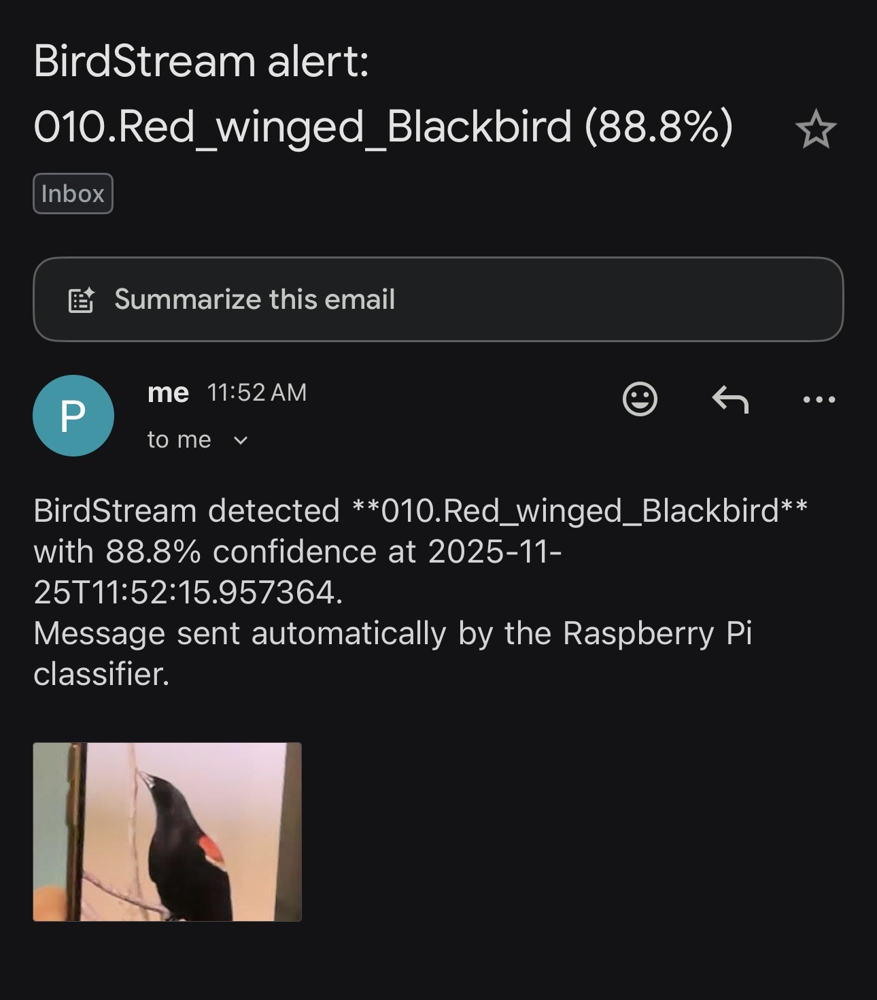
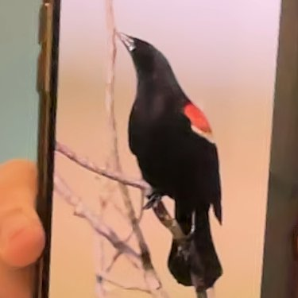

# BirdStream Raspberry Pi

## Overview

`rpiScript.py` captures video from a connected camera, crops and normalizes each frame, runs it through the trained ResNet50 bird classifier, and overlays the top prediction on the display. When the classifier is confident enough, the script optionally encodes the cropped bird image, throttles repeated notifications, and sends a Gmail alert using SMTP.

## Setup

1. **Dependencies on the Pi**
   - Python 3.8+ with `torch`, `torchvision`, `numpy`, `opencv-python`, `Pillow`.
   - Copy the trained weights (`model_Transfer_ep=85_acc=0.8117.pt`) and the `CUB_200_2011` labels directory alongside `rpiScript.py`.
   - Ensure the camera device works (e.g., `raspistill` or simple OpenCV capture test).

2. **Gmail SMTP prep**
   - Enable 2-Step Verification for your Gmail account at [https://myaccount.google.com/security](https://myaccount.google.com/security).
   - Generate an App Password for “Mail” and note the 16-character string.

3. **.env configuration**
   - Create a `.env` in the same folder as `rpiScript.py` and add:
     ```bash
     export BIRDSTREAM_EMAIL_ENABLED=1
     export BIRDSTREAM_EMAIL_SMTP_SERVER=smtp.gmail.com
     export BIRDSTREAM_EMAIL_SMTP_PORT=587
     export BIRDSTREAM_EMAIL_USE_TLS=1
     export BIRDSTREAM_EMAIL_USERNAME=your‑gmail@gmail.com
     export BIRDSTREAM_EMAIL_PASSWORD=<app-password>
     export BIRDSTREAM_EMAIL_FROM=your‑gmail@gmail.com
     export BIRDSTREAM_EMAIL_TO=your‑gmail@gmail.com
     ```
   - Optional overrides:
     * `BIRDSTREAM_EMAIL_CONFIDENCE_THRESHOLD` (default `75` percent)
     * `BIRDSTREAM_EMAIL_RESET_GAP` (confidence drop that resets cooldown)
     * `BIRDSTREAM_EMAIL_ALERT_COOLDOWN` (seconds to wait before emailing the same label again; default `300`)
     * `BIRDSTREAM_EMAIL_ATTACH_IMAGE` (`0` to disable JPEG attachments)
     * `BIRDSTREAM_EMAIL_TIMEOUT` (SMTP timeout seconds)

## How it works

1. The script loads `.env`, builds the architecture, loads weights, and precomputes transforms.
2. Every 60 frames it crops, normalizes, and classifies the current frame via `torch.topk`.
3. If the top label exceeds the configured threshold and its cooldown window has expired, the cropped image is JPEG-encoded and attached to the notification email.
4. Alerts are throttled per label; confidence that falls below `threshold − reset_gap` clears the cooldown for that species.

## Running

```bash
cd /path/to/BirdStream
python rpiScript.py
```

Leave it running on the Pi; the window shows the cropped bird and the overlayed prediction while the script samples periodically and emails high-confidence detections to your Gmail address.

## Visual example

Once alerts are enabled, the script can capture the Gmail notification and the cropped frame that accompanies it. Drop two JPEGs in `docs/`:

1. `docs/email_alert_example.jpg` – a screenshot of the Gmail preview showing the subject/body of the alert.
2. `docs/bird_snapshot_example.jpg` – the JPEG that gets attached to the email.

Reference them in this section with Markdown image links (the files are not included here so you can replace them once they exist):





